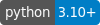
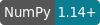

[](https://www.python.org/downloads/) [](https://numpy.org/install/) [](https://arxiv.org) [](LICENSE)
# opBasis
This Python package allows the derivation of a minimal operator basis for typical use cases of lattice gauge theory practicioners.
- **Full documentation** and some introductory examples see the [Github Pages](https://github.com/nikolai-husung/opBasis/doc).
- **Installation** see the instructions below.

## Installation
There are three ways to make this package available on your client:
- Use pip to install the latest version supplied in the git via
```bash
pip3 install opbasis-0.9.6-py3-none-any.whl
```
- Run the Makefile to build and install the latest version yourself.
- Add the *opbasis* folder containing all the python source files to your work directory or to `sys.path`.
The package requires python in version 3.10 or higher and [NumPy](https://numpy.org/install/) in version 1.21 or higher.

## TODO

